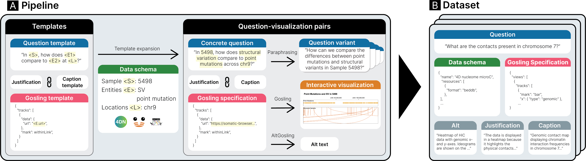

# GQVis Dataset: Natural Language to Genomics Visualization

This repository contains the code for generating the **GQVis** dataset available on [Hugging Face](https://huggingface.co/datasets/HIDIVE/GQVis).

The code generates a collection of natural language **Q**ueries on genomics **D**ata and responds with a visualization specification in the form of a [Gosling](https://github.com/gosling-lang) grammar.

📂 **Dataset on Hugging Face**: [HIDIVE/GQVis](https://huggingface.co/datasets/HIDIVE/GQVis)  

---
## 🚀 Overview



1. **Template Generation** will create abstract questions and specifications with placeholders for sample, entities, and location as well as constraints for those sample and entities.
2. **Data-schema/All-schema** are our defined dataset schemas retrieved from 4DN, ENCODE, and Chromoscope. 
3. **Template Expansion** will reify the template questions/specifications given the provided schemas for all possibilities that satify the constraints.
4. **Paraphraser** will use an LLM framework to paraphrase input questions to cover different styles of expertise and formality in the input.
5. **Multi-step** defines links, chains, and scripts to generate multi-step queries. 
6. **Alt-Gosling** exports bulk Alt-Gosling text based on the resulting .csv file. 
---


## 🗂️ Folder Structure

```
.
├── datasets/        # Source structured data files
├── ideogram_data/   # Ideograma data for template expansion
├── location_data/   # Retrieve location for genomic intervals
├── misc/            # Helper code for our paper 
├── multi-step/      # Contains code for multi-step generation and linking
├── paraphraser.py   # LLM code to paraphrase questions
├── template_expansion.py   # Code to reify template questions
├── template_generation.py  # Code to create abstract questions and Gosling specifications
└── README.md        # This file
```

---
